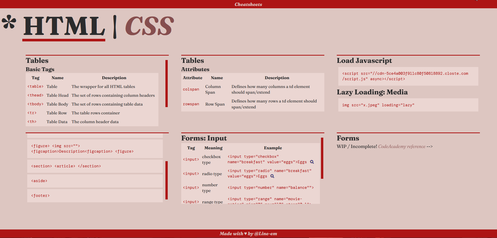

```
⚠️ I will be archiving this project for now, as at the moment, I'm more focused on my React projects. There's a lot to fix in this one, so I will get back to it later.
```

# HTML Cheatsheet // Notes

Single-Page HTML Cheatsheet built at CodeAcademy's Front End Engineer course. 🎉



It contains Table / Forms / Semantic information, and it's currently a WIP.

## Overview

I believe this could be quite useful in the future for reference, so I plan to keep working on it. Some overall changes planned are:

-   Finish the Forms section;
-   Create a CSS page;
-   Polish the page, fix the grid and make its design consistent.

## Changelog

-   1.0 - Initial commit.
